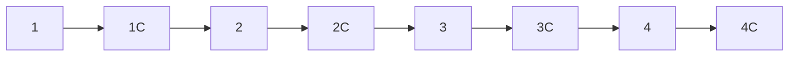
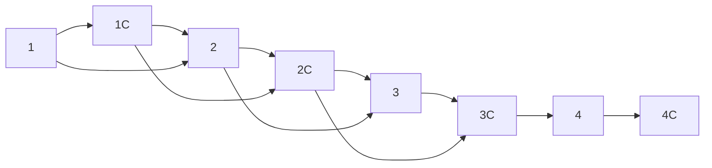

[TOC]

## 复杂链表的复制

输入一个复杂链表（每个节点中有节点值，以及两个指针，一个指向下一个节点，另一个特殊指针指向任意一个节点），返回结果为复制后复杂链表的 head。
注意，输出结果中请不要返回参数中的节点引用，否则判题程序会直接返回空

### 解法
复制的全过程可分为三步：
+ 首先复制每个节点，并将其插入至被复制节点的后面，如 1->2->3 变为 1->1->2->2->3->3；
+ 然后连接复制节点对应的随机节点，根据上述复制规则，**显然每个复制节点对应的随机节点，应该位于被复制节点对应的随机节点的后面**；
+ 从这个合并的链表中把原链表和复制链表分离，即 1 的下一个改为指向 2，2 的下一个改为指向 3，同理 1C的下一个改为指向 2C，2C的下一个改为指向 3C，**彼此奇偶交替连接**，最后返回 $head.next$，即复制链





#### 代码
```java
public class CopyComplexList
{
    /**
     * 复杂链表的复制
     *
     * @param pHead 链表头结点
     * @return 复制的链表
     */
    public RandomListNode clone(RandomListNode pHead)
    {
        if (pHead == null)
        {
            return null;
        }

        // 第一步：复制节点，并插入至被复制节点的后面
        RandomListNode cur = pHead;
        while (cur != null)
        {
            RandomListNode cloneNode = new RandomListNode(cur.label);
            cloneNode.next = cur.next;
            cur.next = cloneNode;
            cur = cloneNode.next;
        }

        // 第二步：连接复制节点对应的随机节点
        cur = pHead;
        while (cur != null)
        {
            if (cur.random != null)
            {
                cur.next.random = cur.random.next;
            }

            cur = cur.next.next;
        }

        // 第三步：把原链表和复制链表分离
        cur = pHead;
        RandomListNode result = pHead.next, temp;
        while (cur.next != null)
        {
            temp = cur.next;
            cur.next = temp.next;
            cur = temp;
        }
        return result;
    }
}
```


### 测试用例参考
1. 功能测试（结点中的 random 指针指向结点自身；两个结点的 random 形成环状结构；链表中只有一个结点）；
2. 特殊输入测试（指向链表头结点的指针为空指针）。
